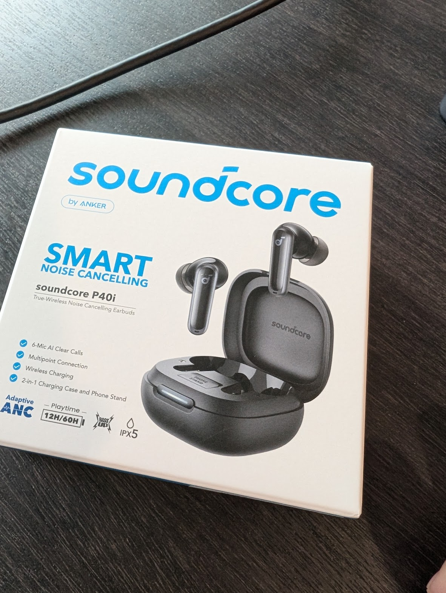
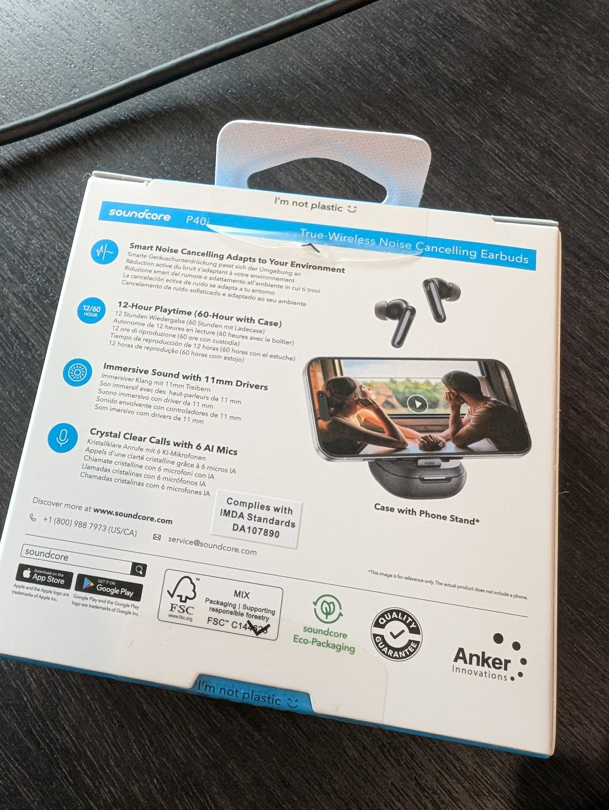
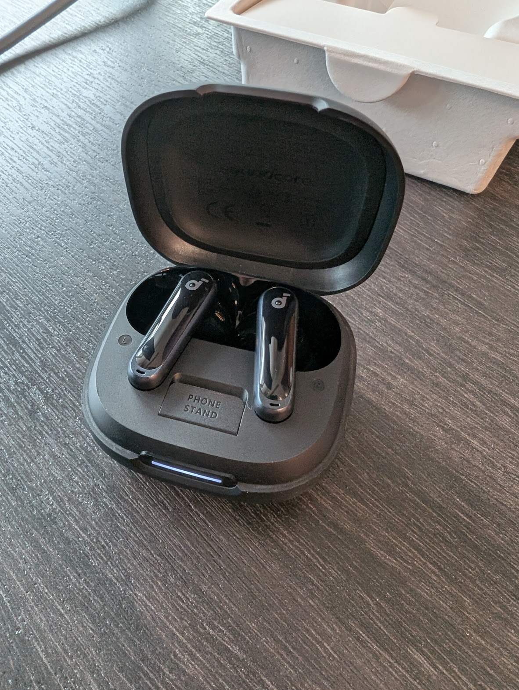
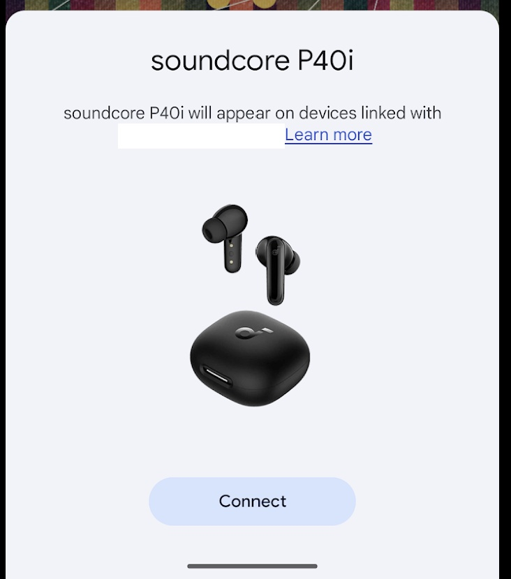

## Soundcore P40i earbuds

# Finally gave up my old ones

I've had the Pixel Buds A (v1) for a number of years. I really really liked that it had these lovely wingtips that held on securely to the ear and stayed in super securely which allowed me to use it for jogging.

The other plus point was the tight Google Assistant integration which allowed for hands-free voice and music control while cycling. 

BUT, over the years firstly I damaged the left side such that the sound volume was weak. AND it's gotten really stinky from my sweaty sports workout. 

Finally couldn't stand it any longer and chucked it into the bin. No more earbuds.

# Happened upon a promo for Soundcore

It so happens that Safra was having a SG60 promo, with Best Denki for this particular model Soundcore P40i for S$60.
Not the best Soundcore model (their Liberty ANC series) or their even cheaper range R40? R50? that I've been using for watching TV.

So I just went ahead. 

Fit is ok, they give 5 sizes of fittings.
The app provides lots of customizations like sound isolation modes, some fancy surround sound mode that is really quite impressive etc.

I'd even say that weird USP of a earbud case that doubles as a phone stand is actually really useful for me where my phone doesn't have its own stand. Dang. What an idea.

Would also like to try out the multipoint connection. 
