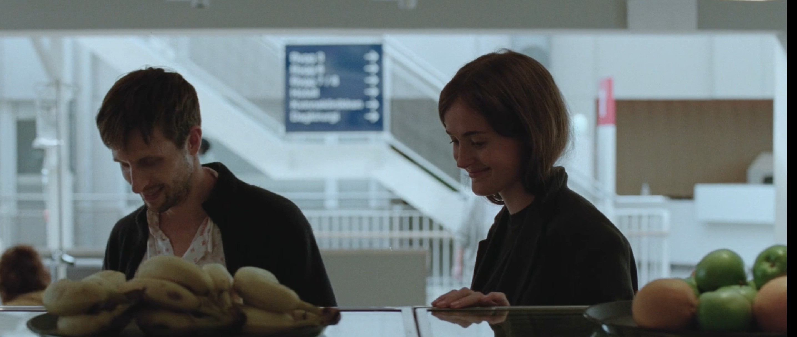

## A quarter into the new work

It's been busy busy, and also exciting at the new place. I'm glad it's been largely ok with fitting in, getting the hang of the new environment, both human and technical. It's a relief to know that my skills and experience are useful, and worth something..relevant. It's also good to know that I manage to suggest and implement changes or improvements on top of learning their existing routine. 

But also pretty surprisingly to see how they are missing a good amount of things.

Well, things to do I guess. 

Definitely really appreciate the proximity to home, being able to spend more time with the children and wife and home. I think it's a more suitable stage for this point in life. If I were much younger, not yet settled down, it would be the worst. It would be a boring dead office, no exciting colours or people, or activities. It would be the worst place to meet people. But it's great for me. Routine, development, home, proxmity, familiarity with what I know.

## Contrast with another world

The previous true blue corporate world, so corporate that it's the stuck and dry financial services industry, uptight to the max in compliance and risk avoidance. On top of that the straight and dry world of computers, of a boring term IT, which doesn't sound exciting to outsiders, but is quite intriguing to me in many ways.

It contrasts so to the musical theatre space, acting singing dancing writing choreographing, sound mixing, lights, expressions, feelings. So very different. Of people with the different preferences, skills, character, orientations, dressing, expressions. 

But also so funny that we still come close to it often. And also diving into art films, literature. 

It's nice to see.

## Disappearing into the void

Rewatched The Worst Person In the World, Joachim Trier, Renate Reinsve, Anders Danielsen Lie, Herbert Nordrum.

It's hard to describe, it's so many things, across many years and stages of life. It's a really silly girl, living, growing, being. Who knows. 
Maybe she will find herself, what she gave up on, lost, wasn't ready for. 
Maybe the follies, the insecurities, the confusion of youth, needs to be lived and learnt. 